# HRIS Database Master Plan

Dokumen ini menggantikan skema lama yang masih berfokus pada absensi wajah saja. Target baru sistem adalah menjadi fondasi HRIS yang lengkap, sehingga data untuk dashboard, CRUD admin, approval, payroll, dan laporan bisa ditampilkan lebih utuh.

## 1. Prinsip Desain

1. `users` tetap menjadi tabel autentikasi utama.
2. Data HR dipisah ke tabel domain agar tidak semua kolom menumpuk di `users`.
3. Semua proses bisnis penting harus punya:
   - status yang jelas,
   - jejak approval,
   - relasi ke master data,
   - kolom yang cukup untuk reporting.
4. Skema harus mendukung:
   - multi branch,
   - struktur organisasi,
   - self service employee,
   - approval admin / HR,
   - payroll dan laporan.

## 2. Modul HRIS Target

### Core Master Data
- Users / authentication
- Employee profiles
- Branches
- Departments
- Positions
- Work shifts
- Employment types
- Locations

### Employee Administration
- Emergency contacts
- Employee documents
- Education history
- Career history
- Bank account and personal identity data

### Attendance & Time Management
- Attendances
- Attendance corrections
- Holidays
- Attendance locations / geofence

### Leave Management
- Leave types
- Leave balances
- Leave requests

### Expense & Claims
- Reimbursements

### Payroll
- Payrolls
- Payroll components
- Payroll component items

### Communication & Performance
- Announcements
- Notifications
- KPI scores

## 3. ERD Baru

```mermaid
erDiagram
    users }o--|| departments : belongs_to
    users }o--|| positions : holds
    users }o--|| work_shifts : follows
    users }o--|| branches : assigned_to
    users }o--|| employment_types : classified_as
    users }o--o| users : reports_to
    users ||--|| employee_profiles : has_one
    users ||--o{ employee_emergency_contacts : has_many
    users ||--o{ employee_documents : has_many
    users ||--o{ employee_educations : has_many
    users ||--o{ employee_career_histories : has_many
    users ||--o{ attendances : records
    users ||--o{ leave_requests : submits
    users ||--o{ reimbursements : submits
    users ||--o{ payrolls : receives
    users ||--o{ leave_balances : owns
    users ||--o{ attendance_corrections : submits
    users ||--o{ kpi_scores : evaluated

    branches ||--o{ departments : hosts
    branches ||--o{ locations : owns
    branches ||--o{ work_shifts : applies
    branches ||--o{ holidays : scopes

    departments }o--o| departments : parent_of
    departments ||--o{ users : contains
    positions ||--o{ users : assigned_to
    work_shifts ||--o{ users : assigned_to
    employment_types ||--o{ users : assigned_to

    locations ||--o{ attendances : geofence_source
    leave_types ||--o{ leave_requests : requested_as
    leave_types ||--o{ leave_balances : quota_source
    payrolls ||--o{ payroll_component_items : contains
    payroll_components ||--o{ payroll_component_items : typed_as

    users {
        bigint id PK
        string name
        string email UK
        string password
        string role
        bigint department_id FK
        bigint branch_id FK
        bigint position_id FK
        bigint work_shift_id FK
        bigint employment_type_id FK
        bigint manager_id FK
        boolean is_active
    }

    employee_profiles {
        bigint id PK
        bigint user_id UK,FK
        string employee_code UK
        string identity_number
        string tax_number
        date joined_at
        date contract_start_at
        date contract_end_at
        string employment_status
    }

    branches {
        bigint id PK
        string name
        string code UK
        boolean is_head_office
        boolean is_active
    }

    departments {
        bigint id PK
        string name
        string code UK
        bigint head_id FK
        bigint parent_id FK
        bigint branch_id FK
        boolean is_active
    }

    positions {
        bigint id PK
        string name
        string code
        string grade
        decimal salary
        decimal allowance
        decimal overtime_rate
        boolean is_active
    }

    work_shifts {
        bigint id PK
        bigint branch_id FK
        string name
        time clock_in_time
        time clock_out_time
        time break_start_time
        time break_end_time
        int late_tolerance_minutes
        json work_days
    }

    locations {
        bigint id PK
        bigint branch_id FK
        string name
        string code UK
        decimal latitude
        decimal longitude
        int radius
    }

    employment_types {
        bigint id PK
        string name
        string code UK
        string category
    }

    attendances {
        bigint id PK
        bigint user_id FK
        date attendance_date
        string type
        datetime check_in_at
        datetime check_out_at
        bigint location_id FK
        int late_minutes
        int overtime_minutes
        int work_minutes
        string status
    }

    attendance_corrections {
        bigint id PK
        bigint attendance_id FK
        bigint user_id FK
        date attendance_date
        string status
        bigint approved_by FK
    }

    leave_types {
        bigint id PK
        string name
        string code
        int max_days_per_year
        boolean is_paid
        boolean requires_balance
    }

    leave_balances {
        bigint id PK
        bigint user_id FK
        bigint leave_type_id FK
        int year
        decimal allocated_days
        decimal used_days
        decimal remaining_days
    }

    leave_requests {
        bigint id PK
        string request_number
        bigint user_id FK
        bigint leave_type_id FK
        date start_date
        date end_date
        int total_days
        string status
        bigint approved_by FK
    }

    reimbursements {
        bigint id PK
        string request_number
        bigint user_id FK
        decimal amount
        string type
        string status
        bigint approved_by FK
    }

    payrolls {
        bigint id PK
        string payroll_number
        bigint user_id FK
        int month
        int year
        decimal basic_salary
        decimal total_earnings
        decimal total_deductions
        decimal net_salary
        string status
    }

    payroll_components {
        bigint id PK
        string name
        string code UK
        string type
    }

    payroll_component_items {
        bigint id PK
        bigint payroll_id FK
        bigint payroll_component_id FK
        decimal amount
    }
```

## 4. CRUD yang Wajib Ada

Supaya HRIS benar-benar usable, modul berikut minimal harus punya list, detail, create, edit, delete atau status update:

| Modul | CRUD / Action Minimum | Tujuan |
|------|------|------|
| Branches | CRUD | Multi kantor / cabang |
| Departments | CRUD | Struktur organisasi |
| Positions | CRUD | Jabatan dan kompensasi |
| Work Shifts | CRUD | Jadwal kerja |
| Employment Types | CRUD | Permanent, contract, intern, freelance |
| Locations | CRUD | Geofence absensi |
| Employees | CRUD lengkap | Data induk karyawan |
| Employee Profiles | Edit lengkap | Biodata dan administratif |
| Emergency Contacts | CRUD | Kontak darurat |
| Documents | CRUD | KTP, NPWP, kontrak, sertifikat |
| Educations | CRUD | Riwayat pendidikan |
| Career Histories | CRUD | Mutasi / promosi |
| Attendances | List, detail, correction approval | Monitoring kehadiran |
| Leave Types | CRUD | Master jenis cuti |
| Leave Balances | Generate / adjust | Kuota cuti |
| Leave Requests | Create, approve, reject | Proses cuti |
| Reimbursements | Create, approve, reject | Klaim biaya |
| Payrolls | Generate, view, mark paid | Penggajian |
| Payroll Components | CRUD | Tunjangan, potongan, BPJS, dll |
| Announcements | CRUD | Broadcast info internal |
| KPI Scores | CRUD | Penilaian performa |
| Holidays | CRUD | Kalender kerja |

## 5. Data yang Harus Ditampilkan di UI

### Employee Detail Page
- Data akun
- Identitas karyawan
- Penempatan organisasi
- Data kontrak
- Bank account
- Kontak darurat
- Dokumen
- Pendidikan
- Riwayat karier
- Ringkasan attendance
- Ringkasan cuti
- Ringkasan payroll

### Admin Dashboard
- Total employee aktif
- Employee per branch
- Employee per department
- Attendance hari ini
- Late / on-time / absent
- Pending leave requests
- Pending reimbursements
- Payroll draft vs paid
- Contract expiry
- Probation ending soon
- Announcement aktif

### Employee Dashboard
- Status attendance hari ini
- Jadwal shift
- Leave balance
- Pending request status
- Slip gaji terakhir
- Announcement relevan

## 6. Workflow Approval Inti

### Leave Request
`draft` -> `pending` -> `approved` / `rejected` / `cancelled`

### Reimbursement
`draft` -> `pending` -> `approved` / `rejected` -> `paid`

### Attendance Correction
`pending` -> `approved` / `rejected`

### Payroll
`draft` -> `reviewed` -> `paid`

## 7. Implementasi Saat Ini

Migration baru yang ditambahkan:

- `2026_04_22_210000_expand_hris_core_schema.php`

Migration ini menambahkan:

- tabel master HRIS baru,
- tabel detail employee,
- tabel leave balance,
- tabel attendance correction,
- tabel holiday,
- tabel payroll component,
- serta perluasan kolom pada tabel inti yang sudah ada.

## 8. Tahap Implementasi Selanjutnya

1. Sinkronisasi model Eloquent ke relasi baru.
2. Buat seeder master data HRIS.
3. Refactor controller admin agar pakai struktur baru.
4. Tambah CRUD penuh untuk master data yang belum ada.
5. Refactor dashboard agar memakai metrik dari skema baru.
6. Buat halaman employee detail yang benar-benar lengkap.

## 9. Catatan Penting

Skema ini masih menjaga kompatibilitas dasar dengan modul yang sudah ada, tetapi arah jangka panjangnya adalah memindahkan data personal karyawan dari `users` ke `employee_profiles` dan tabel turunannya. Itu akan membuat data lebih rapi, validasi lebih kuat, dan query reporting lebih masuk akal untuk kebutuhan HRIS lengkap.
