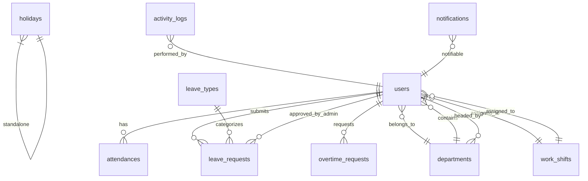

# 🏗️ Rencana Implementasi Fitur HRD & Deployment
## Website Absensi Wajah — Portfolio Showcase Edition

---

## 📋 Daftar Isi

1. [Audit Fitur Saat Ini](#-audit-fitur-saat-ini)
2. [Rencana Penambahan Fitur](#-rencana-penambahan-fitur)
3. [Strategi Deployment Gratis](#-strategi-deployment-gratis)
4. [Estimasi Waktu & Prioritas](#-estimasi-waktu--prioritas)
5. [Struktur Database Baru](#-struktur-database-baru)

---

## 🔍 Audit Fitur Saat Ini

### Tech Stack Aktif
| Komponen | Teknologi |
|---|---|
| Backend | Laravel 13 (PHP 8.3+) |
| Frontend | Blade + Tailwind CSS 3 + Alpine.js |
| AI | face-api.js (client-side) |
| Database | SQLite (dev) / MySQL (prod) |
| Build Tool | Vite 8 |
| PDF Export | barryvdh/laravel-dompdf |

### Fitur Yang Sudah Ada ✅

| # | Modul | Fitur | Status |
|---|---|---|---|
| 1 | **Auth** | Login/Register (Laravel Breeze) | ✅ Ada |
| 2 | **Face Registration** | Pendaftaran biometrik wajah via webcam | ✅ Ada |
| 3 | **Attendance** | Check-in/Check-out dengan validasi wajah AI | ✅ Ada |
| 4 | **Geo-Location** | Validasi lokasi berdasarkan radius | ✅ Ada |
| 5 | **Admin Dashboard** | Statistik karyawan, hadir/tidak hadir hari ini | ✅ Ada |
| 6 | **Kelola Karyawan** | List, Edit, Hapus karyawan | ✅ Ada |
| 7 | **Kelola Lokasi** | CRUD lokasi kantor (multi-lokasi) | ✅ Ada |
| 8 | **Export CSV** | Download laporan absensi CSV | ✅ Ada |
| 9 | **Export PDF** | Download laporan absensi PDF | ✅ Ada |
| 10 | **Role System** | Admin & Employee (basic) | ✅ Ada |
| 11 | **Dark/Light Mode** | Toggle tema UI | ✅ Ada |

### Kekurangan Yang Perlu Diperbaiki ⚠️

| # | Masalah | Dampak |
|---|---|---|
| 1 | Tidak ada sistem **Departemen** | Karyawan tidak terorganisir per divisi |
| 2 | Tidak ada **Jam Kerja / Shift** | Tidak bisa validasi terlambat/tepat waktu |
| 3 | Tidak ada **Cuti & Izin** | Fitur HR paling dasar belum ada |
| 4 | Tidak ada **Overtime/Lembur** tracking | Tidak bisa hitung jam lembur |
| 5 | Tidak ada **Landing Page** | Untuk portfolio, butuh halaman showcase |
| 6 | Dashboard kurang **analitik** | Hanya statistik dasar, belum ada chart |
| 7 | Tidak ada **Riwayat Aktivitas** (Audit Log) | Tidak bisa tracking siapa mengubah apa |
| 8 | Tidak ada **Notifikasi** | Admin tidak terinfo real-time |

---

## 🚀 Rencana Penambahan Fitur

### Fase 1: Fondasi Data Organisasi 🏢
**Prioritas: 🔴 KRITIS** — Departemen & Shift adalah tulang punggung sistem HRD

#### 1.1 Modul Departemen
> Model: `Department`

**Fitur:**
- CRUD Departemen (nama, kode, deskripsi, kepala departemen)
- Setiap karyawan terhubung ke 1 departemen
- Filter absensi berdasarkan departemen
- Statistik per departemen di Admin Dashboard

**Database Migration:**
```php
Schema::create('departments', function (Blueprint $table) {
    $table->id();
    $table->string('name');               // "IT Department"
    $table->string('code')->unique();     // "IT"
    $table->text('description')->nullable();
    $table->foreignId('head_id')->nullable()->constrained('users')->nullOnDelete();
    $table->boolean('is_active')->default(true);
    $table->timestamps();
});

// Tambah kolom di users table
Schema::table('users', function (Blueprint $table) {
    $table->foreignId('department_id')->nullable()->constrained()->nullOnDelete();
});
```

#### 1.2 Modul Shift & Jam Kerja
> Model: `WorkShift`

**Fitur:**
- CRUD Shift (nama, jam masuk, jam pulang, toleransi keterlambatan)
- Assign shift ke karyawan
- Auto-kalkulasi status: `tepat_waktu`, `terlambat`, `sangat_terlambat`
- Laporan keterlambatan per periode

**Database Migration:**
```php
Schema::create('work_shifts', function (Blueprint $table) {
    $table->id();
    $table->string('name');                    // "Shift Pagi"
    $table->time('clock_in_time');             // 08:00
    $table->time('clock_out_time');            // 17:00
    $table->integer('late_tolerance_minutes')->default(15);
    $table->boolean('is_default')->default(false);
    $table->timestamps();
});

// Tambah kolom di users table
Schema::table('users', function (Blueprint $table) {
    $table->foreignId('work_shift_id')->nullable()->constrained()->nullOnDelete();
});

// Tambah kolom di attendances table
Schema::table('attendances', function (Blueprint $table) {
    $table->string('late_status')->nullable(); // tepat_waktu, terlambat, sangat_terlambat
    $table->integer('late_minutes')->default(0);
});
```

---

### Fase 2: Manajemen Cuti & Izin 📝
**Prioritas: 🔴 KRITIS** — Fitur HRD yang paling sering dipakai

#### 2.1 Modul Tipe Cuti
> Model: `LeaveType`

**Fitur:**
- Master data jenis cuti (Tahunan, Sakit, Menikah, Melahirkan, dll)
- Kuota per tahun per tipe
- Aturan apakah butuh lampiran (surat dokter, dll)

**Database Migration:**
```php
Schema::create('leave_types', function (Blueprint $table) {
    $table->id();
    $table->string('name');                    // "Cuti Tahunan"
    $table->integer('max_days_per_year');       // 12
    $table->boolean('requires_attachment')->default(false);
    $table->text('description')->nullable();
    $table->boolean('is_active')->default(true);
    $table->timestamps();
});
```

#### 2.2 Modul Pengajuan Cuti
> Model: `LeaveRequest`

**Fitur:**
- Karyawan mengajukan cuti dari dashboard mereka
- Pilih tipe cuti, tanggal mulai/selesai, alasan
- Upload lampiran (surat dokter, dll)
- Admin menyetujui/menolak dengan catatan
- Status tracking: `pending` → `approved` / `rejected`
- Sisa kuota cuti otomatis terhitung
- Notifikasi ke admin saat ada pengajuan baru

**Database Migration:**
```php
Schema::create('leave_requests', function (Blueprint $table) {
    $table->id();
    $table->foreignId('user_id')->constrained()->onDelete('cascade');
    $table->foreignId('leave_type_id')->constrained()->onDelete('cascade');
    $table->date('start_date');
    $table->date('end_date');
    $table->integer('total_days');
    $table->text('reason');
    $table->string('attachment_path')->nullable();
    $table->enum('status', ['pending', 'approved', 'rejected'])->default('pending');
    $table->text('admin_note')->nullable();
    $table->foreignId('approved_by')->nullable()->constrained('users')->nullOnDelete();
    $table->timestamp('responded_at')->nullable();
    $table->timestamps();
});
```

---

### Fase 3: Overtime / Lembur Tracking ⏰
**Prioritas: 🟡 PENTING**

> Model: `OvertimeRequest`

**Fitur:**
- Karyawan bisa request lembur dengan alasan
- Admin menyetujui/menolak
- Auto-kalkulasi jam lembur dari selisih checkout vs jam shift
- Laporan lembur bulanan

**Database Migration:**
```php
Schema::create('overtime_requests', function (Blueprint $table) {
    $table->id();
    $table->foreignId('user_id')->constrained()->onDelete('cascade');
    $table->date('overtime_date');
    $table->time('start_time');
    $table->time('end_time');
    $table->decimal('total_hours', 4, 2);
    $table->text('reason');
    $table->enum('status', ['pending', 'approved', 'rejected'])->default('pending');
    $table->text('admin_note')->nullable();
    $table->foreignId('approved_by')->nullable()->constrained('users')->nullOnDelete();
    $table->timestamps();
});
```

---

### Fase 4: Kalender & Hari Libur 📅
**Prioritas: 🟡 PENTING**

> Model: `Holiday`

**Fitur:**
- Master data hari libur nasional & perusahaan
- Kalender visual interaktif (FullCalendar.js)
- Tampilkan kehadiran, cuti, libur dalam satu view
- Import hari libur nasional otomatis

**Database Migration:**
```php
Schema::create('holidays', function (Blueprint $table) {
    $table->id();
    $table->string('name');
    $table->date('date');
    $table->enum('type', ['national', 'company'])->default('national');
    $table->text('description')->nullable();
    $table->timestamps();
});
```

---

### Fase 5: Dashboard Analytics yang Impresif 📊
**Prioritas: 🔴 KRITIS** — Ini yang bikin portofolio standout!

**Fitur:**
- **Chart Kehadiran Mingguan/Bulanan** — Line chart tren kehadiran (Chart.js / ApexCharts)
- **Pie Chart Departemen** — Distribusi karyawan per departemen
- **Bar Chart Keterlambatan** — Top 5 karyawan paling sering terlambat
- **Heatmap Kehadiran** — Kalender heatmap kehadiran seluruh karyawan
- **KPI Cards Animasi** — Presentase kehadiran, rata-rata jam kerja, total lembur bulan ini
- **Real-time Counter** — Animasi angka berjalan saat halaman dimuat
- **Widget Cuaca** (bonus) — Tampilkan cuaca lokasi kantor via API gratis

**Library yang Digunakan:**
```
ApexCharts (via CDN) — Gratis, modern, interaktif
```

---

### Fase 6: Notifikasi & Alert System 🔔
**Prioritas: 🟢 SEDANG**

**Fitur:**
- Notifikasi in-app (bell icon di navbar)
- Alert untuk admin: pengajuan cuti baru, karyawan terlambat
- Alert untuk karyawan: status cuti disetujui/ditolak
- Badge counter unread notifications

**Database Migration:**
```php
// Menggunakan Laravel built-in notifications table
Schema::create('notifications', function (Blueprint $table) {
    $table->uuid('id')->primary();
    $table->string('type');
    $table->morphs('notifiable');
    $table->text('data');
    $table->timestamp('read_at')->nullable();
    $table->timestamps();
});
```

---

### Fase 7: Audit Log & Keamanan 🔒
**Prioritas: 🟢 SEDANG**

> Model: `ActivityLog`

**Fitur:**
- Log semua aktivitas penting (login, CRUD karyawan, approve cuti, dll)
- Tampilkan timeline aktivitas di admin panel
- Filter berdasarkan user, tipe aksi, tanggal

**Database Migration:**
```php
Schema::create('activity_logs', function (Blueprint $table) {
    $table->id();
    $table->foreignId('user_id')->nullable()->constrained()->nullOnDelete();
    $table->string('action');        // created, updated, deleted, login, approved
    $table->string('model_type')->nullable();
    $table->unsignedBigInteger('model_id')->nullable();
    $table->json('old_values')->nullable();
    $table->json('new_values')->nullable();
    $table->string('ip_address')->nullable();
    $table->string('user_agent')->nullable();
    $table->timestamps();
});
```

---

### Fase 8: Landing Page Showcase & Polish 🎨
**Prioritas: 🔴 KRITIS** — First impression untuk portofolio!

**Fitur:**
- **Hero Section** — Tagline impresif + animasi face-scan mockup
- **Fitur Showcase** — Grid 6 fitur utama dengan icon & deskripsi
- **Tech Stack Section** — Logo teknologi yang dipakai
- **Screenshot Gallery** — Carousel screenshot dashboard (mobile + desktop)
- **Live Demo CTA** — Tombol langsung ke demo login
- **Footer** — Link GitHub, LinkedIn, kontak

**Desain Estetik:**
- Glassmorphism cards
- Gradient background (dark theme dominant)
- Scroll-triggered animations (AOS.js via CDN)
- Responsive 100% (mobile-first)

---

## ☁️ Strategi Deployment Gratis

### Analisis Platform

> [!IMPORTANT]
> Project ini adalah **Laravel (PHP)** — bukan static site. Vercel dan Netlify **TIDAK cocok** karena mereka hanya mendukung static site / Node.js serverless. Laravel butuh PHP runtime + database persistent.

| Platform | PHP Support | Database | Storage | Free Tier | Cocok? |
|---|---|---|---|---|---|
| **Vercel** | ❌ Tidak native | ❌ | ❌ | Unlimited | ❌ **Tidak cocok** |
| **Netlify** | ❌ Tidak native | ❌ | ❌ | Unlimited | ❌ **Tidak cocok** |
| **Railway** | ✅ PHP/Nixpacks | ✅ MySQL/PostgreSQL gratis | ✅ Volume | $5 credit/bulan | ✅ **Sangat cocok** |
| **Render** | ✅ Docker | ✅ PostgreSQL (90 hari) | ✅ Disk | Free tier | ✅ **Cocok** |
| **Fly.io** | ✅ Docker | ✅ SQLite Volume | ✅ Volume 1GB | Free 3 VM | ✅ **Sangat cocok** |
| **Coolify** (self-host) | ✅ Docker | ✅ Apapun | ✅ Full | VPS ~$4/bln | ⚡ **Terbaik** |

### 🏆 Rekomendasi Utama: **Railway**

> [!TIP]
> **Railway** adalah pilihan terbaik untuk Laravel karena setup paling mudah, ada MySQL gratis, dan build otomatis dari GitHub.

**Kelebihan Railway:**
- ✅ Auto-detect Laravel via Nixpacks (zero config)
- ✅ MySQL/PostgreSQL add-on gratis (dalam $5 credit)
- ✅ Auto-deploy dari GitHub push
- ✅ Custom domain gratis
- ✅ Environment variables GUI
- ✅ Free $5 credit/bulan (cukup untuk demo/portofolio)
- ✅ SSL otomatis

**Setup Railway:**
```bash
# 1. Push project ke GitHub
# 2. Buka railway.app → New Project → Deploy from GitHub
# 3. Tambah MySQL Service
# 4. Set environment variables:
#    APP_ENV=production
#    APP_KEY=base64:xxxxx
#    DB_CONNECTION=mysql
#    DB_HOST=(dari Railway MySQL)
#    DB_DATABASE=(dari Railway MySQL)
#    DB_USERNAME=(dari Railway MySQL)
#    DB_PASSWORD=(dari Railway MySQL)
# 5. Tambah Start Command: php artisan migrate --force && php artisan serve --host=0.0.0.0 --port=$PORT
```

### 🥈 Alternatif 1: **Fly.io** (SQLite, Paling Hemat)

**Kelebihan:**
- ✅ Gratis 3 VM (lebih dari cukup)
- ✅ Bisa pakai SQLite langsung (Volume persistent)
- ✅ Performa bagus (edge deployment)

**Kekurangan:**
- ⚠️ Setup agak lebih rumit (butuh Dockerfile + fly.toml)
- ⚠️ SQLite tidak ideal untuk concurrent writes besar

### 🥉 Alternatif 2: **Render**

**Kelebihan:**
- ✅ Docker support baik
- ✅ PostgreSQL gratis

**Kekurangan:**
- ⚠️ Free tier PostgreSQL dihapus setelah 90 hari
- ⚠️ Cold start lambat di free tier

### 💡 Alternatif Kreatif: **Vercel (Landing) + Railway (App)**

Untuk portofolio yang optimal:
- **Landing page** (Fase 8) bisa di-*extract* jadi static HTML → deploy ke **Vercel/Netlify** (gratis unlimited)
- **Aplikasi utama** Laravel → deploy ke **Railway**
- Landing page link ke app Railway untuk demo

---

## ⏰ Estimasi Waktu & Prioritas

### Urutan Implementasi

| Fase | Modul | Estimasi | Prioritas | Dependensi |
|---|---|---|---|---|
| **8** | Landing Page Showcase | 2-3 hari | 🔴 KRITIS | Tidak ada |
| **1** | Departemen & Shift | 2-3 hari | 🔴 KRITIS | Tidak ada |
| **5** | Dashboard Analytics | 2-3 hari | 🔴 KRITIS | Fase 1 |
| **2** | Cuti & Izin | 3-4 hari | 🔴 KRITIS | Fase 1 |
| **4** | Kalender & Hari Libur | 1-2 hari | 🟡 PENTING | Fase 2 |
| **3** | Overtime / Lembur | 2-3 hari | 🟡 PENTING | Fase 1 |
| **6** | Notifikasi & Alert | 1-2 hari | 🟢 SEDANG | Fase 2, 3 |
| **7** | Audit Log | 1-2 hari | 🟢 SEDANG | Tidak ada |
| **-** | **Deployment & Testing** | 1-2 hari | 🔴 KRITIS | Semua fase |
| | **TOTAL** | **~15-24 hari** | | |

> [!NOTE]
> Urutan di atas sudah dioptimalkan: **Landing Page duluan** agar bisa langsung *showoff* di LinkedIn/portofolio sambil fitur lain dikembangkan bertahap.

---

## 🗄️ Struktur Database Baru



---

## 📁 Struktur File Baru (Estimasi)

```
app/
├── Http/Controllers/
│   ├── Admin/
│   │   ├── DashboardController.php      (upgrade: analytics)
│   │   ├── DepartmentController.php     ★ BARU
│   │   ├── WorkShiftController.php      ★ BARU
│   │   ├── LeaveRequestController.php   ★ BARU
│   │   ├── LeaveTypeController.php      ★ BARU
│   │   ├── OvertimeController.php       ★ BARU
│   │   ├── HolidayController.php        ★ BARU
│   │   ├── ActivityLogController.php    ★ BARU
│   │   ├── EmployeeController.php       (upgrade: dept filter)
│   │   ├── AttendanceController.php     (upgrade: late status)
│   │   ├── ExportController.php         (upgrade: lebih detail)
│   │   └── LocationController.php
│   └── Employee/
│       ├── LeaveController.php          ★ BARU
│       └── OvertimeController.php       ★ BARU
├── Models/
│   ├── Department.php                   ★ BARU
│   ├── WorkShift.php                    ★ BARU
│   ├── LeaveType.php                    ★ BARU
│   ├── LeaveRequest.php                 ★ BARU
│   ├── OvertimeRequest.php              ★ BARU
│   ├── Holiday.php                      ★ BARU
│   ├── ActivityLog.php                  ★ BARU
│   ├── User.php                         (upgrade: relations)
│   ├── Attendance.php                   (upgrade: late tracking)
│   └── CompanySetting.php
├── Notifications/
│   ├── LeaveRequestNotification.php     ★ BARU
│   ├── LeaveResponseNotification.php    ★ BARU
│   └── OvertimeNotification.php         ★ BARU
└── Observers/
    └── ActivityLogObserver.php           ★ BARU

resources/views/
├── landing.blade.php                    ★ BARU (showcase)
├── admin/
│   ├── departments.blade.php            ★ BARU
│   ├── work-shifts.blade.php            ★ BARU
│   ├── leave-types.blade.php            ★ BARU
│   ├── leave-requests.blade.php         ★ BARU
│   ├── overtime.blade.php               ★ BARU
│   ├── holidays.blade.php               ★ BARU
│   ├── activity-log.blade.php           ★ BARU
│   ├── calendar.blade.php               ★ BARU
│   └── dashboard.blade.php              (upgrade: charts)
└── employee/
    ├── leave-request.blade.php          ★ BARU
    ├── overtime-request.blade.php       ★ BARU
    └── calendar.blade.php               ★ BARU

database/migrations/
├── xxxx_create_departments_table.php         ★ BARU
├── xxxx_create_work_shifts_table.php         ★ BARU
├── xxxx_create_leave_types_table.php         ★ BARU
├── xxxx_create_leave_requests_table.php      ★ BARU
├── xxxx_create_overtime_requests_table.php   ★ BARU
├── xxxx_create_holidays_table.php            ★ BARU
├── xxxx_create_activity_logs_table.php       ★ BARU
├── xxxx_add_department_shift_to_users.php    ★ BARU
└── xxxx_add_late_status_to_attendances.php   ★ BARU
```

---

## 🎯 Checklist Sebelum Deploy (Portfolio-Ready)

- [ ] Semua fitur di atas sudah berjalan
- [ ] Seed data demo yang realistis (10+ karyawan, 3 departemen, data absensi 1 bulan)
- [ ] Landing page responsive & impresif
- [ ] README.md diperbarui dengan screenshot & fitur lengkap
- [ ] Demo account credentials tampil di landing page
- [ ] Error handling & validasi rapi
- [ ] Mobile responsive 100%
- [ ] Dark/Light mode konsisten di semua halaman baru
- [ ] Performance: lazy loading, pagination
- [ ] SEO meta tags di landing page
- [ ] Open Graph tags untuk share di LinkedIn/socmed
- [ ] Favicon & branding konsisten

---

> [!CAUTION]
> Jangan deploy ke Vercel/Netlify! Platform tersebut **tidak mendukung PHP runtime** secara native. Gunakan **Railway** (rekomendasi utama) atau **Fly.io** sebagai alternatif.
